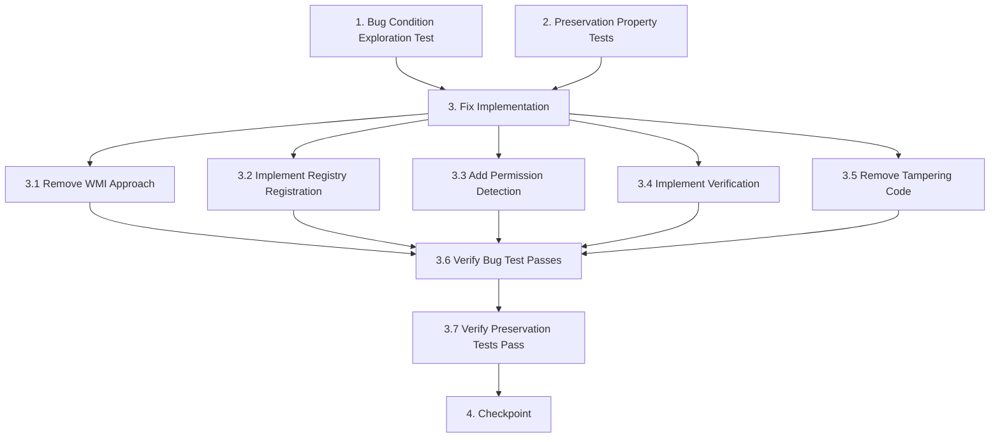

# Implementation Plan

## Overview

This implementation plan follows the bugfix workflow for fixing the WSC registration failure. The tasks are ordered according to the bug condition methodology:
1. **Exploration Test** (Task 1) - Write a test that fails on unfixed code to understand the bug
2. **Preservation Tests** (Task 2) - Write tests that pass on unfixed code to capture baseline behavior
3. **Implementation** (Task 3) - Apply the fix with proper understanding
4. **Validation** (Task 4) - Verify the fix works and preserves existing behavior

## Tasks

- [x] 1. Write bug condition exploration test
  - **Property 1: Bug Condition** - WSC Registration via WMI API Fails
  - **CRITICAL**: This test MUST FAIL on unfixed code - failure confirms the bug exists
  - **DO NOT attempt to fix the test or the code when it fails**
  - **NOTE**: This test encodes the expected behavior - it will validate the fix when it passes after implementation
  - **GOAL**: Surface counterexamples that demonstrate the bug exists
  - **Scoped PBT Approach**: For deterministic bugs, scope the property to the concrete failing case(s) to ensure reproducibility
  - Test that running `register-wsc.ps1` (unfixed) with WMI `CreateInstance()` and `Put()` fails to create registry keys under `HKLM\SOFTWARE\Microsoft\Security Center\Provider\Av_{GUID}`
  - Test that `Get-WmiObject -Class AntiVirusProduct` does NOT return GSM Shield AV after running unfixed script
  - Test that script exits with code 0 (silent failure) despite registration not occurring
  - Test that no registry values exist for `displayName`, `pathToSignedProductExe`, or `productState` after unfixed script runs
  - Run test on UNFIXED code
  - **EXPECTED OUTCOME**: Test FAILS (this is correct - it proves the bug exists)
  - Document counterexamples found:
    - WMI `Put()` returns null or completes silently
    - Registry keys missing under `HKLM\SOFTWARE\Microsoft\Security Center\Provider\Av_{GUID}`
    - WSC query does not return GSM Shield AV entry
  - Mark task complete when test is written, run, and failure is documented
  - _Requirements: 1.1, 1.4, 1.5_

- [x] 2. Write preservation property tests (BEFORE implementing fix)
  - **Property 2: Preservation** - Non-WSC Script Execution Behavior
  - **IMPORTANT**: Follow observation-first methodology
  - Observe behavior on UNFIXED code for non-buggy inputs (ps-runner executions, first-run orchestration, error logging)
  - Observe: ps-runner.js correctly executes `disable-defender.ps1` and captures stdout/stderr/exit codes
  - Observe: first-run.js runs all steps in sequence and sets `first_run_complete='1'` in database
  - Observe: errors are appended to `error.log` with timestamps
  - Observe: `defender:setup-result` IPC message is sent to renderer with step summaries
  - Write property-based tests capturing observed behavior patterns:
    - For all non-`register-wsc.ps1` script executions, ps-runner.js captures output identically
    - For all first-run sequences, orchestrator completes all steps and updates database
    - For all error conditions, logging continues to work with proper formatting
    - For all IPC interactions, messages are sent correctly to renderer
  - Property-based testing generates many test cases for stronger guarantees
  - Run tests on UNFIXED code
  - **EXPECTED OUTCOME**: Tests PASS (this confirms baseline behavior to preserve)
  - Mark task complete when tests are written, run, and passing on unfixed code
  - _Requirements: 3.1, 3.2, 3.3, 3.4, 3.5, 3.6, 3.7, 3.8_

- [x] 3. Fix for WSC Registration Failure

  - [x] 3.1 Remove WMI CreateInstance/Put approach from register-wsc.ps1
    - Delete the `$wmiClass.CreateInstance()` code block
    - Delete the `$newProduct.Put()` code block
    - Remove all references to WMI-based registration
    - _Bug_Condition: isBugCondition(scriptExecution) where scriptExecution.wmiClass = 'root\SecurityCenter2:AntiVirusProduct' AND scriptExecution.contains('CreateInstance()') AND scriptExecution.contains('Put()')_
    - _Expected_Behavior: Registration SHALL use registry-based Security Provider API instead of WMI_
    - _Preservation: ps-runner.js execution behavior unchanged_
    - _Requirements: 1.1, 2.1_

  - [x] 3.2 Implement Security Provider Registry Registration
    - Create registry keys under `HKLM\SOFTWARE\Microsoft\Security Center\Provider\Av_{instanceGuid}` using PowerShell `New-Item`
    - Set `displayName` (REG_SZ) to "GSM Shield AV" using `Set-ItemProperty`
    - Set `pathToSignedProductExe` (REG_SZ) to full path of `GSM Shield AV.exe`
    - Set `pathToSignedReportingExe` (REG_SZ) to full path of `GSM Shield AV.exe`
    - Set `productState` (REG_DWORD) to 266240 (enabled, up-to-date)
    - Generate `{instanceGuid}` using `[guid]::NewGuid().ToString()` for uniqueness
    - _Bug_Condition: isBugCondition(scriptExecution) where NOT registryKeyExists('HKLM\SOFTWARE\Microsoft\Security Center\Provider\Av_{GUID}')_
    - _Expected_Behavior: Registry keys SHALL be created with correct values for WSC registration_
    - _Preservation: Script path resolution via resolveScriptsDir() unchanged_
    - _Requirements: 2.1, 2.4_

  - [x] 3.3 Add Permission Detection and Error Handling
    - Wrap registry operations in `try-catch` blocks to detect access denied errors
    - Exit with non-zero exit code (1) when registration fails due to insufficient permissions
    - Log specific error messages to stdout/stderr for error.log capture
    - Include check for elevated privileges using `[Security.Principal.WindowsPrincipal]` and `IsInRole("Administrator")`
    - _Bug_Condition: isBugCondition(scriptExecution) where scriptExecution.exitCode = 0 AND registration fails_
    - _Expected_Behavior: Script SHALL exit with non-zero code when registration fails_
    - _Preservation: Error logging to error.log unchanged_
    - _Requirements: 2.6, 3.6_

  - [x] 3.4 Implement Proper Verification Logic
    - After registry key creation, use `Get-WmiObject -Namespace "root\SecurityCenter2" -Class AntiVirusProduct` to verify registration
    - Filter results for `displayName='GSM Shield AV'`
    - Check that `productState=266240` in query results
    - Exit with code 0 only if verification succeeds
    - Exit with code 1 if verification fails (registry keys created but WSC query returns no results)
    - _Bug_Condition: isBugCondition(scriptExecution) where NOT wscQueryReturnsGSMShieldAV()_
    - _Expected_Behavior: Verification SHALL confirm GSM Shield AV appears in WSC query results_
    - _Preservation: ps-runner stdout/stderr/exitCode capture unchanged_
    - _Requirements: 1.5, 2.4, 3.1_

  - [x] 3.5 Remove Defender Tampering Code
    - Remove attempts to set `HKLM\SOFTWARE\Policies\Microsoft\Windows Defender\DisableAntiSpyware` from register-wsc.ps1
    - Remove attempts to modify `HKLM\SOFTWARE\Microsoft\Windows Defender\Features\TamperProtection` registry keys
    - These operations trigger Windows Defender malware detection (`Trojan:Win32/MpTamperSrvDisableAV`)
    - Note: Keep tamper protection handling in disable-defender.ps1, which uses documented Set-MpPreference API
    - _Bug_Condition: isBugCondition(scriptExecution) where scriptExecution.triggersDefenderDetection = true_
    - _Expected_Behavior: Script SHALL NOT trigger Windows Defender malware detection_
    - _Preservation: disable-defender.ps1 behavior unchanged_
    - _Requirements: 1.2, 1.3, 2.5, 3.4_

  - [x] 3.6 Verify bug condition exploration test now passes
    - **Property 1: Expected Behavior** - WSC Registration via Registry-Based API
    - **IMPORTANT**: Re-run the SAME test from task 1 - do NOT write a new test
    - The test from task 1 encodes the expected behavior
    - When this test passes, it confirms the expected behavior is satisfied
    - Run bug condition exploration test from step 1 on FIXED code
    - Verify registry keys now exist under `HKLM\SOFTWARE\Microsoft\Security Center\Provider\Av_{GUID}`
    - Verify `Get-WmiObject -Class AntiVirusProduct` now returns GSM Shield AV with `productState=266240`
    - Verify script exits with code 0 after successful registration
    - **EXPECTED OUTCOME**: Test PASSES (confirms bug is fixed)
    - _Requirements: 2.1, 2.4, 2.5_

  - [x] 3.7 Verify preservation tests still pass
    - **Property 2: Preservation** - Non-WSC Script Execution Behavior
    - **IMPORTANT**: Re-run the SAME tests from task 2 - do NOT write new tests
    - Run preservation property tests from step 2 on FIXED code
    - Verify ps-runner.js still executes non-WSC scripts correctly
    - Verify first-run.js orchestration still completes all steps
    - Verify error logging still works with proper timestamps
    - Verify IPC messaging still sends `defender:setup-result` correctly
    - **EXPECTED OUTCOME**: Tests PASS (confirms no regressions)
    - Confirm all tests still pass after fix (no regressions)
    - _Requirements: 3.1, 3.2, 3.3, 3.4, 3.5, 3.6, 3.7, 3.8_

- [x] 4. Checkpoint - Ensure all tests pass
  - Run all bug condition tests - verify they pass (confirms fix works)
  - Run all preservation tests - verify they pass (confirms no regressions)
  - Run any existing unit tests in `defender/__tests__/` directory
  - Verify no Windows Defender malware detection occurs when running fixed script
  - Verify GSM Shield AV appears in Windows Security Center UI (manual verification)
  - Ask the user if questions arise or if manual testing assistance is needed

## Task Dependency Graph



```json
{
  "waves": [
    {
      "name": "Exploration & Preservation",
      "tasks": ["1", "2"]
    },
    {
      "name": "Implementation",
      "tasks": ["3.1", "3.2", "3.3", "3.4", "3.5"]
    },
    {
      "name": "Validation",
      "tasks": ["3.6", "3.7", "4"]
    }
  ]
}
```

## Notes

- **Critical**: Tasks 1 and 2 MUST be completed BEFORE task 3 (implementation)
- **Exploration Test (Task 1)**: This test is expected to FAIL on unfixed code - failure confirms the bug exists
- **Preservation Tests (Task 2)**: These tests are expected to PASS on unfixed code - passing confirms baseline behavior
- **Property Format**: Tasks use `**Property N: Type**` format to enable hover status in the IDE
- **Requirements Traceability**: Each task includes `_Requirements: X.Y_` annotations linking to bugfix.md
- **Manual Verification**: Task 4 includes manual verification steps that require user interaction with Windows Security Center UI
